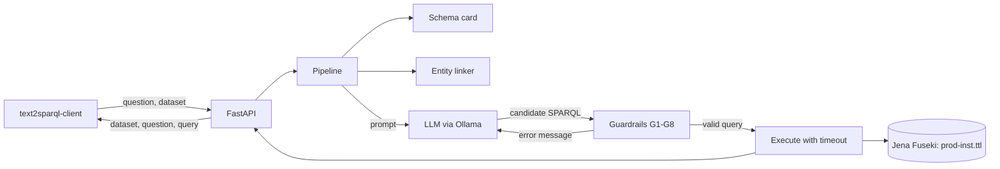

# guarded-text2sparql

Turns a plain-English question into a SPARQL query over eccenca's **CK25** corporate
knowledge graph. A local language model proposes the query; deterministic guardrails
decide whether it is returned. Scored with the official
[TEXT2SPARQL](https://text2sparql.aksw.org/) challenge client.

**The model proposes, code decides.** A language model is good at language and bad at
knowing that Karen Brant's IRI ends in `%40company.org`. So the model writes the query,
and ordinary code supplies the facts and checks the output. Nothing the model produces
is trusted until it has been verified against the graph.

> **Status:** the system and its evaluation harness are complete and tested offline.
> The measured results are being collected; `results/RESULTS.md` is generated from them.
> Progress is tracked in [issues](../../issues).

## Architecture



One question flows like this:

| Step | Who | What happens |
|---|---|---|
| 0 | code, once | Introspect the store into a **schema card** and a **label index** of 3,890 names |
| 1 | code | Reject any dataset IRI the system does not serve |
| 2 | **LLM** | Extract the named things in the question |
| 3 | code | Resolve each to IRIs that exist: exact, then token, then fuzzy match |
| 4 | **LLM** | Write the query, given the schema, the resolved IRIs and toy-domain examples |
| 5 | code | **Guardrails G1-G8** |
| 6 | code | Execute with a 10 s timeout |
| 7 | **LLM** | Repair, given the exact error. At most twice |
| 8 | code | Return the first query that passes, else the last one that parsed |

## The guardrails

| | Check | On failure |
|---|---|---|
| G1 | **Read-only.** SELECT or ASK only; every update form and `SERVICE` blocked | Rejected outright, never repaired |
| G2 | **Syntax.** Parses as SPARQL 1.1 | Repair with the parser's message |
| G3 | **Prefixes.** Fixed set; missing ones declared automatically | Auto-fixed, unknown ones reported |
| G4 | **Vocabulary.** Every `pv:` term exists in the ontology | Repair: `pv:suppliedBy does not exist. Did you mean pv:hasSupplier?` |
| G5 | **Entity existence.** Every instance IRI is in the store | Repair with the real candidates |
| G6 | **Execution.** Runs within 10 s | Repair with the store's own error |
| G7 | **Plausibility.** An empty non-ASK, non-aggregate answer is suspicious | One repair, then accepted: empty can be correct |
| G8 | **Bounded.** At most two repairs | Return the best available query |

Terms are read from the query with string literals and comments blanked out first, so a
label like `"pv:NotATerm"` inside a `FILTER` is never mistaken for vocabulary.

## Quickstart

Needs [uv](https://docs.astral.sh/uv/), Docker and [Ollama](https://ollama.com).

```bash
make data store load   # CK25 at a pinned commit, Fuseki on :3030, load prod-inst.ttl
make truth             # sanity check: all 50 reference queries return results
make test              # the whole suite, no model or API key needed
```

```bash
make rehearse          # seconds: proves the whole measurement harness with a stub LLM
```

Then, to measure for real (this loads the model and will make the machine slow):

```bash
ollama pull qwen2.5-coder:7b
make smoke             # minutes: one real scored run, to catch problems early
make evaluate          # A0-A3 on the dev questions, 3 runs each, resumable
# freeze the design, then:
make evaluate-test     # the 35 held-back questions, seen once
```

`make evaluate` skips any run it has already scored, so it can be stopped and restarted.

## Results

`qwen2.5-coder:7b` on one A40, temperature 0, three runs per configuration.
Full tables in [results/RESULTS.md](results/RESULTS.md), environment in
[results/ENVIRONMENT.md](results/ENVIRONMENT.md).

**The 35 held-back test questions**, run once after the design was frozen:

| Config | What it adds | F1 | Exact |
|---|---|---|---|
| A0 | LLM only | 0.029 | 1/35 |
| A1 | + schema card | 0.084 | 2/35 |
| A2 | + entity linking | **0.170** | 5/35 |
| A3 | + guardrails and repair | 0.170 | 5/35 |

The three runs of each configuration are bit-identical, so the range is zero.

**What each part is worth.** Telling the model what exists nearly triples F1 (A0 → A1).
Resolving names to real IRIs doubles it again (A1 → A2) — unsurprising once you see that
`empl-Karen.Brant%40company.org` is unguessable. Together they take the system from
0.029 to 0.170, a roughly six-fold improvement over the bare model.

**The guardrails change what is returned, not how often it is right.** A3 scores exactly
what A2 scores. This is the project's most interesting result and it is worth stating
plainly rather than burying: repairs fire on 156 of 265 questions and fix the reported
problem in 19% of them, but fixing a broken query usually turns it into a *valid* wrong
query, not a right one. A wrong answer expressed in correct SPARQL scores no better.

What the guardrails do buy is a different property, one F1 cannot show:

- Every returned query is read-only. No update form or federated `SERVICE` call can leave
  the system, and that is enforced by code rather than by asking the model nicely.
- Every returned query uses vocabulary and entity IRIs that exist, or is reported as
  failing. Of 30 test failures, the system **knew** something was wrong in 21 of them;
  only 13 were valid, executable queries that were simply wrong about the world.
- Nothing is ever executed by the model, and nothing the model claims about its own
  output is trusted.

For a system whose output would be run against a corporate knowledge graph, "never emits
a write query and never invents an IRI" is worth having even at identical F1. The
[error analysis](results/ERROR_ANALYSIS.md) breaks down all 30 failures by cause and
names the next guardrail worth building: a domain/range direction check, which alone
would address 4 of them.

**Paraphrase robustness.** On CK26, the same graph with reworded questions, A3 scores
0.212 (8/50) — no collapse from rewording, though this is not a held-out set: 49 of its
50 reference queries are identical to CK25's.

**Context.** The KIT paper on CK25 reports median F1 between 0.19 and 0.37 for
schema-informed prompting with much larger models, and no valid queries at all without
schema. A 7B model reaching 0.170 on the held-back split sits just below that band,
which is about where it should be.

## Limitations

- One model only, `qwen2.5-coder:7b`. No model-size comparison was run.
- Results are deterministic on fixed hardware but **not across hardware**: the same model
  and code on laptop CPU answered 2 of 15 dev questions differently from the A40.
- 50 questions is a small benchmark; one question is worth 0.02 F1 on the test split.
- `"Ms. Brant"` matches two people in the graph. The linker returns both and the model
  chooses, because inferring gender from an honorific is not something code should do.
- Two reference queries cast with `xsd:int()`, which SPARQL 1.1 does not define.
  Fuseki accepts it, Oxigraph correctly refuses; the store choice follows the benchmark.
- No results are claimed as challenge-comparable: this is a prototype, evaluated with
  the challenge's client but not submitted to it.

## Reproducing

Everything is pinned: the dataset commit (`cb928b2f`), the Fuseki image (`5.1.0`), the
Python dependencies (`uv.lock`), the scorer (`text2sparql-client==2.1.0`) and the model
tag. `results/` is committed. CI runs lint, the full test suite and a FakeLLM smoke run
of the pipeline against a real triple store, with no GPU and no API key.

## Credits and licences

This repository contains no dataset; `scripts/get_data.sh` downloads it.

- **CK25:** Tramp, S. and Pietzsch, R. (eccenca GmbH), *The CK25 Corporate Knowledge
  Reference Dataset for Benchmarking Text 2 SPARQL Question Answering Approaches*, 2025.
  [doi:10.5281/zenodo.16912605](https://doi.org/10.5281/zenodo.16912605) ·
  [repository](https://github.com/eccenca/ck25-dataset) · **CC-BY-4.0**, pinned at
  commit `cb928b2f`. No endorsement by eccenca is implied.
- **Scorer:** [text2sparql-client](https://github.com/AKSW/text2sparql-client) 2.1.0, Apache-2.0.
- **Model:** `qwen2.5-coder:7b`, **Apache-2.0**. Every result records the model that produced it.
- **Store:** [Apache Jena Fuseki](https://jena.apache.org/documentation/fuseki2/) 5.1.0, Apache-2.0.

Code: [Apache-2.0](LICENSE). Cite this repository with [CITATION.cff](CITATION.cff).
