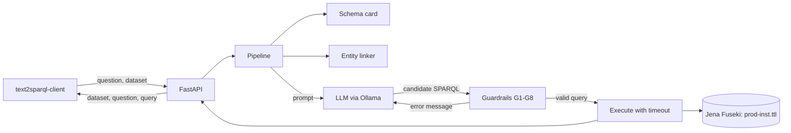

# guarded-text2sparql

Turns a plain-English question into a SPARQL query over eccenca's **CK25** corporate
knowledge graph. A local language model proposes the query; deterministic guardrails
decide whether it is returned. Scored with the official
[TEXT2SPARQL](https://text2sparql.aksw.org/) challenge client.

**The model proposes, code decides.** A language model is good at language and bad at
knowing that Karen Brant's IRI ends in `%40company.org`. So the model writes the query,
and ordinary code supplies the facts and checks the output. Nothing the model produces
is trusted until it has been verified against the graph.

> **Status:** the system and its evaluation harness are complete and tested offline.
> The measured results are being collected; `results/RESULTS.md` is generated from them.
> Progress is tracked in [issues](../../issues).

## Architecture



One question flows like this:

| Step | Who | What happens |
|---|---|---|
| 0 | code, once | Introspect the store into a **schema card** and a **label index** of 3,890 names |
| 1 | code | Reject any dataset IRI the system does not serve |
| 2 | **LLM** | Extract the named things in the question |
| 3 | code | Resolve each to IRIs that exist: exact, then token, then fuzzy match |
| 4 | **LLM** | Write the query, given the schema, the resolved IRIs and toy-domain examples |
| 5 | code | **Guardrails G1-G8** |
| 6 | code | Execute with a 10 s timeout |
| 7 | **LLM** | Repair, given the exact error. At most twice |
| 8 | code | Return the first query that passes, else the last one that parsed |

## The guardrails

| | Check | On failure |
|---|---|---|
| G1 | **Read-only.** SELECT or ASK only; every update form and `SERVICE` blocked | Rejected outright, never repaired |
| G2 | **Syntax.** Parses as SPARQL 1.1 | Repair with the parser's message |
| G3 | **Prefixes.** Fixed set; missing ones declared automatically | Auto-fixed, unknown ones reported |
| G4 | **Vocabulary.** Every `pv:` term exists in the ontology | Repair: `pv:suppliedBy does not exist. Did you mean pv:hasSupplier?` |
| G5 | **Entity existence.** Every instance IRI is in the store | Repair with the real candidates |
| G6 | **Execution.** Runs within 10 s | Repair with the store's own error |
| G7 | **Plausibility.** An empty non-ASK, non-aggregate answer is suspicious | One repair, then accepted: empty can be correct |
| G8 | **Bounded.** At most two repairs | Return the best available query |

Terms are read from the query with string literals and comments blanked out first, so a
label like `"pv:NotATerm"` inside a `FILTER` is never mistaken for vocabulary.

## Quickstart

Needs [uv](https://docs.astral.sh/uv/), Docker and [Ollama](https://ollama.com).

```bash
make data store load   # CK25 at a pinned commit, Fuseki on :3030, load prod-inst.ttl
make truth             # sanity check: all 50 reference queries return results
make test              # the whole suite, no model or API key needed
```

```bash
make rehearse          # seconds: proves the whole measurement harness with a stub LLM
```

Then, to measure for real (this loads the model and will make the machine slow):

```bash
ollama pull qwen2.5-coder:7b
make smoke             # minutes: one real scored run, to catch problems early
make evaluate          # A0-A3 on the dev questions, 3 runs each, resumable
# freeze the design, then:
make evaluate-test     # the 35 held-back questions, seen once
```

`make evaluate` skips any run it has already scored, so it can be stopped and restarted.

## Demo

[**Open the demo page**](https://claude.ai/code/artifact/a80c0125-8df1-4a65-b2b9-e6cfd96af7ff) — all 35
held-back questions with the query the system wrote, what each guardrail said, the answer it
got, and a picture of the facts involved. It is self-contained: no model, no store, nothing to
run. Rebuild it from the saved results with `make demo`.

## Results

Two models, identical code, temperature 0, one A40. Full tables in
[results/RESULTS.md](results/RESULTS.md), setup in
[results/ENVIRONMENT.md](results/ENVIRONMENT.md), failures in
[results/ERROR_ANALYSIS.md](results/ERROR_ANALYSIS.md).

**The 35 held-back test questions**, run after the design was frozen:

| Config | What it adds | 32B F1 | 32B exact | 7B F1 | 7B exact |
|---|---|---|---|---|---|
| A0 | LLM only | 0.029 | 1/35 | 0.029 | 1/35 |
| A1 | + schema card | 0.199 | 6/35 | 0.084 | 2/35 |
| A2 | + entity linking | 0.304 | 9/35 | 0.170 | 5/35 |
| A3 | + guardrails and repair | **0.386** | **11/35** | 0.170 | 5/35 |

**Being told what exists, and given real IRIs, is worth more than model size.** A0 is
identical for both models: 1 question of 35. A model four and a half times larger gains
nothing at all without the schema card and the entity linker, because
`empl-Karen.Brant%40company.org` is not guessable at any scale.

**Guardrails are a multiplier on a capable model, not a crutch for a weak one.** This
inverts the conclusion from the first round and is the most useful thing the project
found. On the 7B, guardrails moved F1 not at all (0.170 to 0.170): repairs fired
constantly and fixed the reported problem 19% of the time, mostly turning a broken query
into a valid wrong one. On the 32B the same guardrails take 0.304 to **0.386**, and
repairs succeed 41% of the time. A repair is a conversation, and it only pays off with a
model able to act on precise feedback.

**What the guardrails guarantee regardless of model.** Every returned query is read-only
and uses vocabulary and IRIs that exist, or is reported as failing. With the 32B this is
visible in the failures: of 24 wrong answers, **zero** are unparseable, use invented
names, or fail to execute. Every mechanical error class is gone; what remains is the
system answering a different question from the one asked. For output destined to run
against a corporate knowledge graph, that property is worth having on its own.

**Context.** The KIT paper reports median F1 between 0.19 and 0.37 for schema-informed
prompting on CK25 with large models, and no valid queries at all without schema. At
0.386 the full system sits at the top of that band.

**Paraphrase robustness.** On CK26, the same graph with reworded questions, the 32B
scores 0.298 (12/50) against the 7B's 0.212 (8/50). Rewording does not break the system.
This is reported separately and is not a held-out score: 49 of CK26's 50 reference
queries are identical to CK25's.

## Limitations

- Two model sizes from one family. No comparison across model families, and no
  hosted frontier model.
- Results are deterministic on fixed hardware but **not across hardware**: the same model
  and code on laptop CPU answered 2 of 15 dev questions differently from the A40.
- 50 questions is a small benchmark; one question is worth 0.02 F1 on the test split.
- `"Ms. Brant"` matches two people in the graph. The linker returns both and the model
  chooses, because inferring gender from an honorific is not something code should do.
- Two reference queries cast with `xsd:int()`, which SPARQL 1.1 does not define.
  Fuseki accepts it, Oxigraph correctly refuses; the store choice follows the benchmark.
- No results are claimed as challenge-comparable: this is a prototype, evaluated with
  the challenge's client but not submitted to it.

## Reproducing

Everything is pinned: the dataset commit (`cb928b2f`), the Fuseki image (`5.1.0`), the
Python dependencies (`uv.lock`), the scorer (`text2sparql-client==2.1.0`) and the model
tag. `results/` is committed. CI runs lint, the full test suite and a FakeLLM smoke run
of the pipeline against a real triple store, with no GPU and no API key.

## Credits and licences

This repository contains no dataset; `scripts/get_data.sh` downloads it.

- **CK25:** Tramp, S. and Pietzsch, R. (eccenca GmbH), *The CK25 Corporate Knowledge
  Reference Dataset for Benchmarking Text 2 SPARQL Question Answering Approaches*, 2025.
  [doi:10.5281/zenodo.16912605](https://doi.org/10.5281/zenodo.16912605) ·
  [repository](https://github.com/eccenca/ck25-dataset) · **CC-BY-4.0**, pinned at
  commit `cb928b2f`. No endorsement by eccenca is implied.
- **Scorer:** [text2sparql-client](https://github.com/AKSW/text2sparql-client) 2.1.0, Apache-2.0.
- **Models:** `qwen2.5-coder:32b` and `qwen2.5-coder:7b`, both **Apache-2.0**. Every
  result records the model that produced it.
- **Store:** [Apache Jena Fuseki](https://jena.apache.org/documentation/fuseki2/) 5.1.0, Apache-2.0.

Code: [Apache-2.0](LICENSE). Cite this repository with [CITATION.cff](CITATION.cff).
